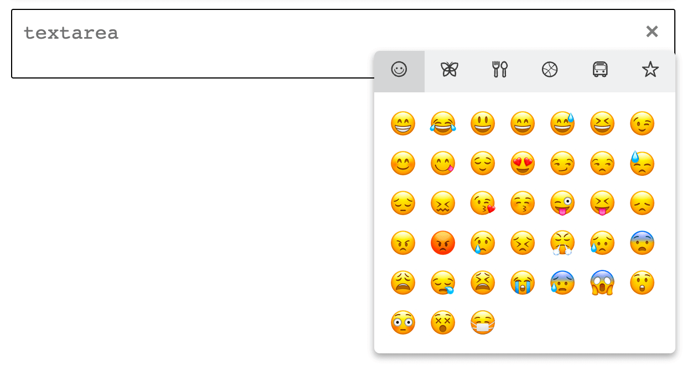

# Native Emoji Picker

#### Modified version of [Meteor-Emoji-Picker](https://github.com/CreateMarketing/Meteor-Emoji-Picker)

This emoji picker is pure, vanilla JavaScript, so should be compatible with most JS projects. Uses the native system/browser's emojis without adding extra images

Demo: https://native-emoji-picker.netlify.com



## How do I use it?

This plugin can be installed from CDN:
```html
<script src="https://cdn.jsdelivr.net/npm/native-emoji/dist/nativeEmoji.min.js"></script>
<link href="https://cdn.jsdelivr.net/npm/native-emoji/dist/nativeEmoji.min.css" rel="stylesheet">
```

or via NPM:

```
npm i native-emoji
```

Include the `nativeEmoji.min.js` and `nativeEmoji.min.css` files from the 'dist' folder in your project, and then use:

```js
new nativeEmoji();
```

Now you can add emoji pickers to your input fields! For a full width emoji picker, simply add the attribute `data-native-emoji-large="true"` to your field. This will create an always open, full width emoji picker below the desired input box.

If you want the classic "press a button to open" style picker, just use `data-native-emoji="true"` on an input field. 

```html
<textarea data-native-emoji="true"></textarea>
```

